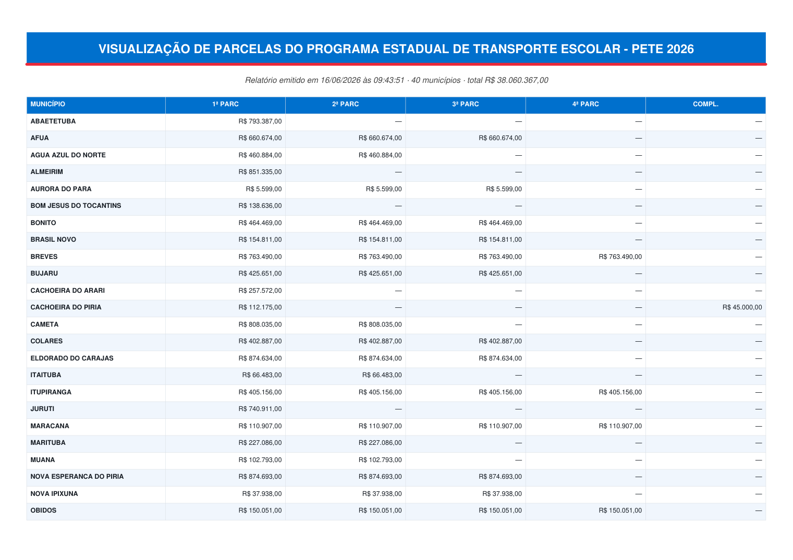
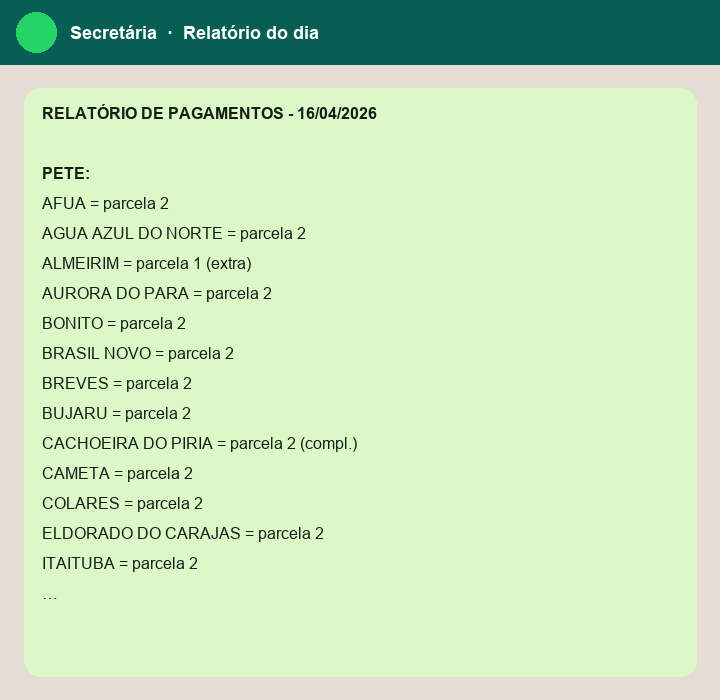

# Monitor PETE/PEAE — SAPF/SEDUC-PA


Acompanhamento **diário** de parcelas pagas às prefeituras nos programas estaduais
**PETE** (transporte escolar) e **PEAE** (alimentação escolar). Sistema irmão do de
Diárias. Substitui duas planilhas Google + AppScripts por um app local que vai do
relatório bruto do SIAFE até o aviso de WhatsApp e os PDFs enviados à Secretária.

## Demonstração
> Imagens geradas a partir de **dados fictícios** (`exemplos/`). Nenhum dado real.

**Dashboard PDF (grade município × parcelas, acumulado do ano):**



**Mensagem de WhatsApp (parcelas do dia):**



## O que faz
1. **Upload** do Relatório de Ordem Bancária do dia (SIAFE, evento 700414).
2. **Bot** (Selenium) pesquisa cada OB nova no SIAFE e traz a descrição.
3. **Revisão**: normaliza a descrição ao padrão `Nª PARCELA DO PETE/2026` (ou PEAE),
   classifica programa/parcela/complemento, casa a prefeitura por **CNPJ**.
4. **Anexa ao razão** (dedup por OB). Marca **anomalias** (2ª OB normal na mesma
   parcela → conferir com a equipe de pagamento; o sistema antigo somava escondendo).
5. **Relatórios**: texto de WhatsApp do dia + 2 PDFs (grade município × parcelas,
   acumulado do ano), um por programa.

## Como rodar
```
pip install -r requirements.txt
start.bat            (ou: streamlit run app.py --server.port 8531)
```
O app abre em http://localhost:8531 (porta diferente do de Diárias, 8501).

### Bot SIAFE (captura automática)
Coloque o **`chromedriver.exe`** (compatível com seu Chrome) em `bot/`. Sem ele, o
app funciona, mas a captura é manual (digita-se a descrição na etapa de revisão).
O bot é **provisório**: quando a SEFA liberar acesso ao PostgreSQL do SIAFE, a
captura vira uma query SQL (ver `store/fonte_descricao.py`) e o bot sai.

## Primeiro uso
Aba **Configurações → Recarregar razão inicial (seed)**: envie o export
`MONITORAMENTO PETE/PEAE 2026 - Página2.csv` para carregar o histórico do ano.

## Demo com dados fictícios (para testar/portfólio)
O repositório **não** contém dados reais. Para rodar uma demonstração:
```
python exemplos/gerar_dados_fake.py        # gera exemplos/seed_exemplo.csv
```
Depois, no app, aba **Configurações → Recarregar razão inicial** → envie
`exemplos/seed_exemplo.csv`. Todos os valores, OBs, processos e datas são
**aleatórios**; só a lista de municípios/CNPJ (pública) é real. O conjunto já
inclui exemplos de **complemento**, **anomalia** (2 OBs na mesma parcela) e
**OB anulada** (descartada), para exercitar os recursos.

As imagens da seção *Demonstração* são reprodutíveis com:
```
python exemplos/gerar_imagens_demo.py     # gera docs/dashboard_pete.png e docs/whatsapp.png
```

## Arquitetura (preparada p/ migrar ao SIMF)
- `core/` — regra de negócio, **Python puro, sem Streamlit** (vira API/JS no SIMF).
  - `municipios.py` (CNPJ→município), `leitura.py` (lê OB), `classificacao.py`
    (descrição→programa/parcela), `razao.py` (tipo + grade), `whatsapp.py`, `pdf.py`.
- `store/` — persistência atrás de interface. `db.py` (SQLite, esquema = razão →
  troca p/ Supabase depois), `fonte_descricao.py` (costura bot→SQL), `seed.py`.
- `bot/` — bot Selenium (worker local).
- `app.py` — casca Streamlit (única peça descartável na migração).

Destino final: card no **Hub DPPC** do SIMF (Next.js 15 + Supabase).
